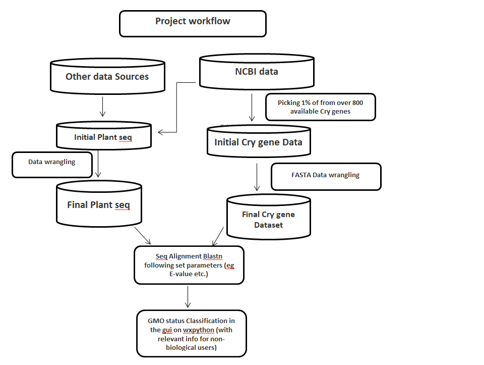

# GMO Status Assessment of Maize and Soybean Samples in Kenya

## Project Workflow

Here's a high-level overview of the bioinformatics analysis workflow for GMO detection:

## Project Overview

This project focuses on the **bioinformatics-driven assessment of Genetically Modified Organism (GMO) status** in maize and soybean samples collected from Kenya. The primary objective was to accurately classify samples as GMO or non-GMO by detecting the presence of specific Cry genes, which are commonly engineered into these crops for pest resistance. This work involved comprehensive genomic data analysis and the development of a custom bioinformatics pipeline.

## Problem Statement

The accurate and efficient detection of GMOs is critical for food safety, regulatory compliance, and consumer confidence. Traditional methods can be time-consuming and labor-intensive. This project addresses the need for a robust, bioinformatics-based method for biomarker detection and classification of GMO status in agricultural samples.

## Methodology

The assessment involved the following key steps:

1.  **Cry Gene Database Curation:** A comprehensive list of approved and relevant Cry genes was curated to serve as target biomarkers. This step was crucial for focusing the analysis on genetically modified elements currently in use.
2.  **Genomic Data Preparation:** Plant genome data from maize and soybean samples were prepared for analysis.
3.  **Sequence Alignment:** **BLASTn** was utilized to perform high-throughput sequence alignment of the curated Cry gene sequences against the plant genomes from the samples.
4.  **Parameter Application:** A stringent set of bioinformatics parameters, including specific **e-value thresholds** and **word size**, was applied during the alignment process to ensure accurate and reliable detection of Cry gene presence.
5.  **Biomarker Detection & Classification:** Based on the alignment results and applied thresholds, samples were classified as either GMO (positive for Cry gene presence) or non-GMO.
6.  **Custom Tool Development:** A custom tool, including a **Graphical User Interface (GUI) developed with wxPython**, was implemented to streamline the analysis process, facilitating data input and output interpretation.

## Tools & Technologies Used

* **Programming Language:** Python
    * Key Libraries: [Biopython, Pandas, NumPy,]
* **Bioinformatics Software:** BLAST+ suite
* **GUI Framework:** wxPython
* **Data Formats:** FASTA

## Project Structure
'''├── code/
│   ├── main.py                # Main script for GMO analysis
│   ├── gui.py                 # wxPython GUI implementation
│   ├── analysis_functions.py  # Core bioinformatics analysis functions
│   └── utils.py               # Utility functions (e.g., data parsing)
├── data/
│   ├── reference_cry_genes.fasta # Curated Cry gene sequences
│   ├── sample_genomes/        # Directory for sample genome files
│   └── results/               # Directory for analysis output
├── documentation.docx         # Original project documentation
└── README.md                  # This file'''
